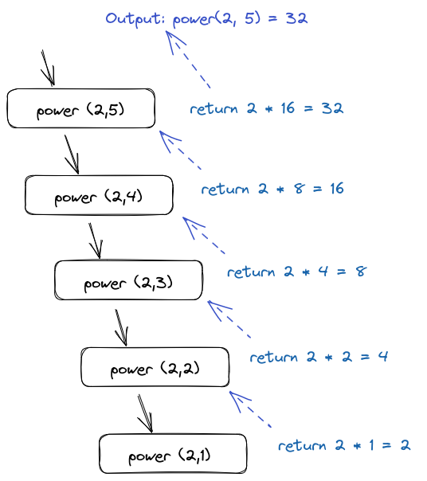

## CP2410 Pracital 03

<br>

> ### Q1. Describe a recursive algorithm for finding the maximum element in a sequence, S, of n elements. What is your running time and space usage?  

``` python
def find_maximum(arr, n):
  if n == 1:
    return arr[0]
  else:
    return max(arr[n - 1], find_maximum(arr, n - 1))
```
The code above will run recursively to find out maximum value.  

Time complexity:  
&nbsp;&nbsp;&nbsp;&nbsp;&nbsp;&nbsp;The code will run till n(the length of array) hits 1, in total it will execute n times, which gives it time complexity of O(n).  

Space complexity:  
&nbsp;&nbsp;&nbsp;&nbsp;&nbsp;&nbsp;The code run one time for base case, and n times for recursion, so the total space complexity is O(n+1)  

<br>

> ### Q2. Draw the recursion trace for the computation of power(2,5), using the traditional function implemented below 

``` python
def power(x, n):
  """ Compute the value x**n for integer n."""
  if n == 0:
    return 1
  else:
    return x * power(x, n - 1)
```
