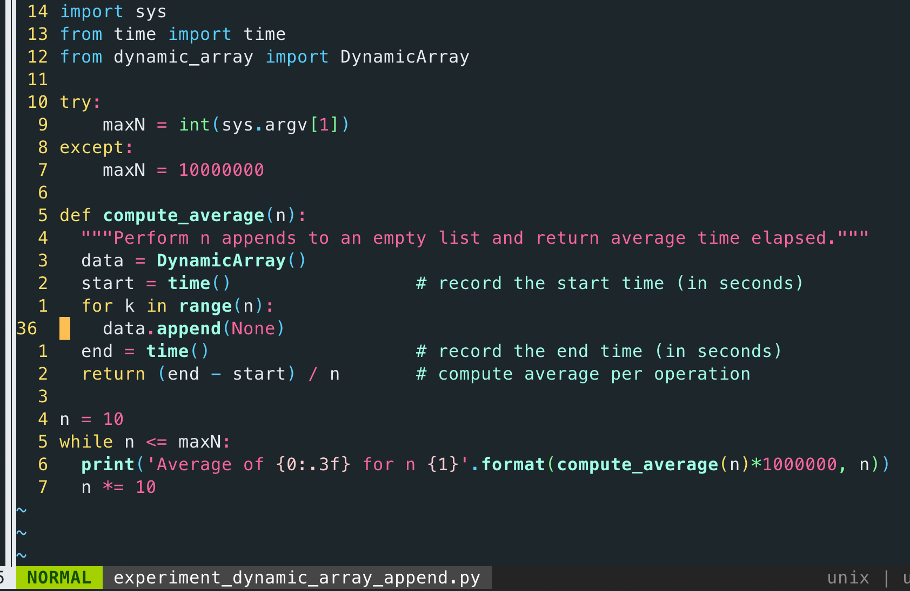

# CP2410 Pracital 03
## Sihan Chen, jcu ID: 14187662
<br>

> ### Q1. Describe a recursive algorithm for finding the maximum element in a sequence, S, of n elements. What is your running time and space usage?  

``` python
def find_maximum(arr, n):
  if n == 1:
    return arr[0]
  else:
    return max(arr[n - 1], find_maximum(arr, n - 1))
```
**Answer:**  
The code above will run recursively to find out maximum value.  

Time complexity:  
&nbsp;&nbsp;&nbsp;&nbsp;&nbsp;&nbsp;The code will run till n(the length of array) hits 1, in total it will execute n times, which gives it time complexity of O(n).  

Space complexity:  
&nbsp;&nbsp;&nbsp;&nbsp;&nbsp;&nbsp;The code run one time for base case, and n times for recursion, so the total space complexity is O(n+1)  

<br>

> ### Q2. Draw the recursion trace for the computation of power(2,5), using the traditional function implemented below 

``` python
def power(x, n):
  """ Compute the value x**n for integer n."""
  if n == 0:
    return 1
  else:
    return x * power(x, n - 1)
```
**Answer:**  


> ### Q3. Draw the recursion trace for the computation of power(2,18), using the repeated squaring algorithm, as implemented below:

``` python
def power(x, n):
  """ Compute the value x**n for integer n."""
  if n == 0:
    return 1
  else:
    partial = power(x, n // 2)
    result = partial * partial
    if n % 2 == 1:
      result *= x
    return result
```
**Answer:**  


<br>

> ### Q4. Give a recursive algorithm to compute the product of two positive integers, m and n, using only addition and subtraction  
**Answer:**  
``` python
def get_product(m, n):
  if n == 1:
    return m
  else:
    return m + get_product(m, n - 1)
```
The above code will calculate products of m and n. The base case is n equal to 1, just return m(m*1). If n is not 1, code run recursively till n eventually decrease to 1. Each time adding m to result. The code will run `len(n)` times, so the final result will be m * n.

<div style="page-break-after: always;"></div>

> ### Q5. Modify ch05/experiment_list_append.py to investigate the time taken by append operations for DynamicArray (ch05/dynamic_array.py).  
**Answer:**  
Modification: import DynamicArray module, and for `data` object, initiate dynamic array instead of using list.  

<br>

Running result comparison:  


<div style="page-break-after: always;"></div>

> ### Q6. Create a modified version of DynamicArray (ch05/dyanmic_array.py) that takes a parameter, resize_factor, which it uses to determine the new size (rather than doubling in the original code - self._resize(2 * self._capacity)). Using different values of resize_factor, examine if and how the average time to append changes.  
**Answer:**  
Modification: create a new class called DynamicArrayWithResize, which inherit from DynamicArray and takes in a resize factor value, override append method to multiply array size by resize factor.  


Running program


Here is the result:  

Resize factor: 2
Average of 7.415 for n 10

Resize factor: 3
Average of 3.910 for n 10

Resize factor: 4
Average of 3.576 for n 10

Resize factor: 2
Average of 0.811 for n 100

Resize factor: 3
Average of 0.601 for n 100

Resize factor: 4
Average of 0.679 for n 100

Resize factor: 2
Average of 0.332 for n 1000

Resize factor: 3
Average of 0.271 for n 1000

Resize factor: 4
Average of 0.255 for n 1000

Resize factor: 2
Average of 0.396 for n 10000

Resize factor: 3
Average of 0.340 for n 10000

Resize factor: 4
Average of 0.296 for n 10000

Resize factor: 2
Average of 0.325 for n 100000

Resize factor: 3
Average of 0.315 for n 100000

Resize factor: 4
Average of 0.304 for n 100000

Resize factor: 2
Average of 0.279 for n 1000000

Resize factor: 3
Average of 0.284 for n 1000000

Resize factor: 4
Average of 0.206 for n 1000000

Resize factor: 2
Average of 0.345 for n 10000000

Resize factor: 3
Average of 0.282 for n 10000000

Resize factor: 4
Average of 0.242 for n 10000000


