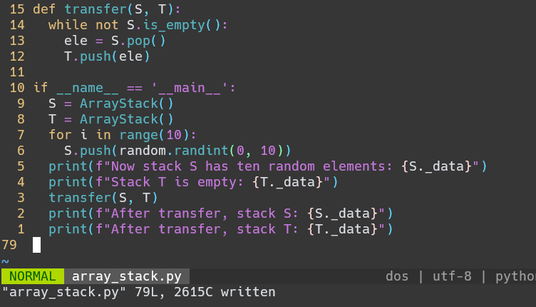
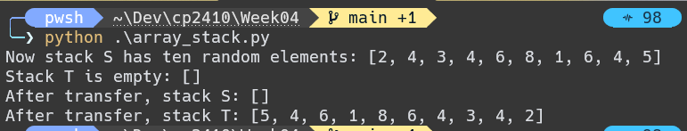

# CP2410 Practical 04

## Question 1
Stack follow the rule of LIFO, method `push` add an element to the end of stack, does not return anything; method `pop` removes and returns the last element of stack. So, here should be the result of the aforementioned series of operations.
```
stack = []
stack.push(5)   # return None; stack = [5]
stack.push(3)   # return None; stack = [5, 3]
stack.pop()     # return 3,  ; stack = [5]
stack.push(2)   # return None; stack = [5, 2]
stack.push(8)   # return None; stack = [5, 2, 8]
stack.pop()     # return 8   ; stack = [5, 2]
stack.pop()     # return 2   ; stack = [5]
stack.push(9)   # return None; stack = [5, 9]
stack.push(1)   # return None; stack = [5, 9, 1]
stack.pop()     # return 1   ; stack = [5, 9]
stack.push(9)   # return None; stack = [5, 9, 9]
stack.push(1)   # return None; stack = [5, 9, 9, 1]
stack.pop()     # return 1   ; stack = [5, 9, 9]
stack.pop()     # return 9   ; stack = [5, 9]
stack.push(1)   # return None; stack = [5, 9, 1]
stack.pop()     # return 1   ; stack = [5, 9]
stack.pop()     # return 9   ; stack = [5]
```

## Question 2
The size of stack S increases by 1 upon `push`, decreases by 1 upon successful `pop`, and unchanged upon `top`.

Since `pop` and `top` are both capable of rasing Empty error, but only `pop` removes element from stack, there are four possible senarios:
1. all three raised by `pop`

	in this case, only 10 - 3 = 7 `pop` were succesfully executed, so the size of stack S is 25(pushes) - 7(pops) = 18

2. two out of three raised by `pop`

	in this case, only 10 - 2 = 8 `pop` were succesfully executed, so the size of stack S is 25(pushes) - 8(pops) = 17

3. one out of three raised by `pop`

	in this case, only 10 - 1 = 9 `pop` were succesfully executed, so the size of stack S is 25(pushes) - 9(pops) = 16

4. all three raised by `top`

	in this case, all 10 `pop` were succesfully executed, so the size of stack S is 25(pushes) - 10(pops) = 15

## Question 3
Here is the implementated and testing code:
<center>
	
</center>
And here is the result:
<center>
	
</center>

## Question 4


## Question 5

## Question 6

## Question 7

