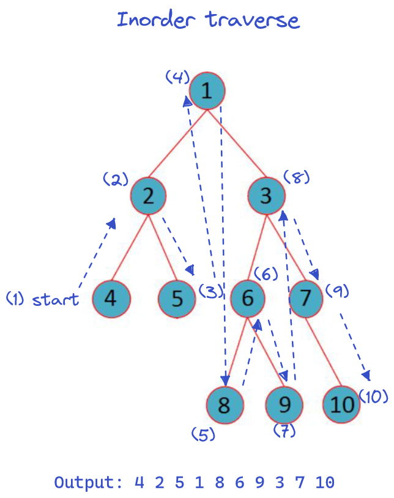
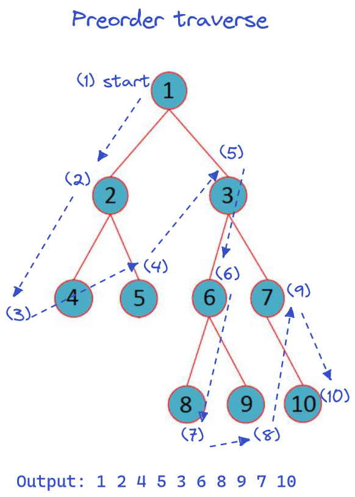
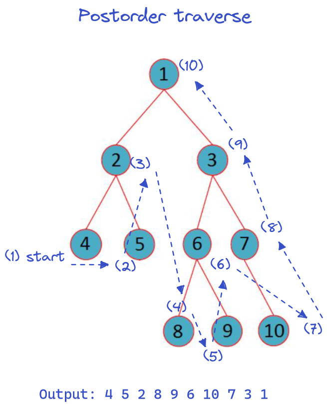
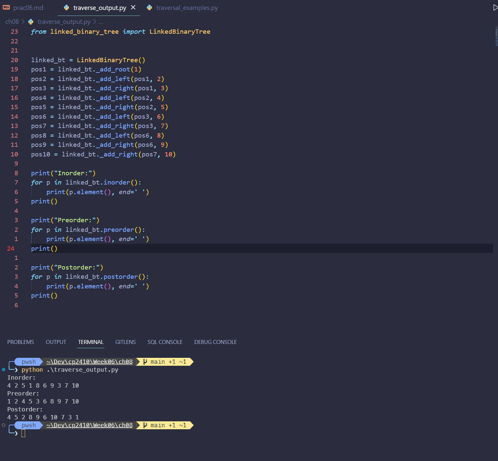

# CP2410 Practical 05
## Sihan Chen, jcu ID: 14187662

## Question 1
a. The root node is `'/user/rt/courses/'`.

b. There are 8 internal nodes, those are: `'/user/rt/courses/'`, `'cs016/'`, `'cs252/'`, `'homeworks/'`, `'programs/'`, `'projects/'`, `'papers/'`, and `'/demos'`.

c. The node `'cs016/'` has 9 descendants.

d. The node `'cs016/'` has one ancestor.

e. The siblings for node `'homeworks/'` are `'grades'` and `'programs/'`.

f. There are 5 nodes in the subtrees rooted at node `'projects/'`, those are: `'papers/'`, `'demos/'`, `'buylow'`, `'sellhigh'`, and `'market'`.

g. The depth of node `'papers/'` is 3.

h. The height of the tree is 4.

## Question 2
a. the inorder traversal should look like this:

b. the preorder traversal should look like this:

c. the postorder traversal should look like this:

## Question 3
Here is the screenshot of the linked binary tree and its three traverse methods implementation code:

outputs are the same as my answer in [Q2](#question-2).
