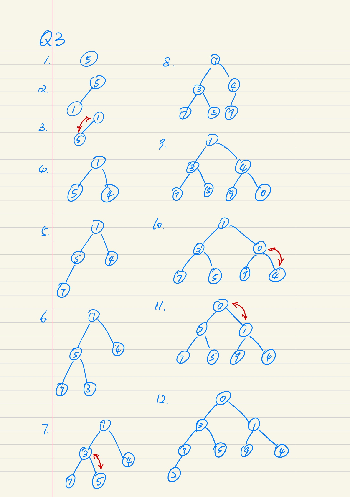
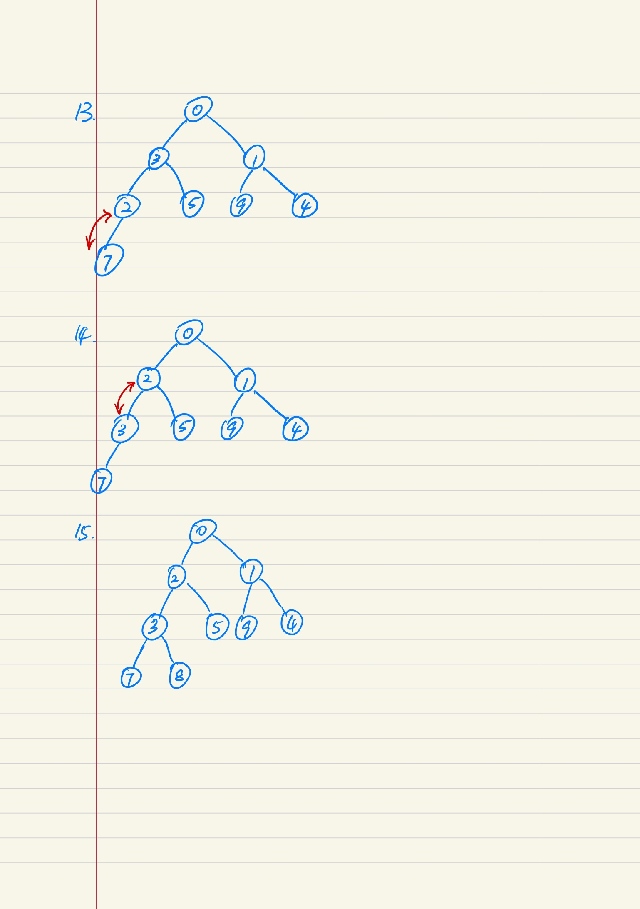
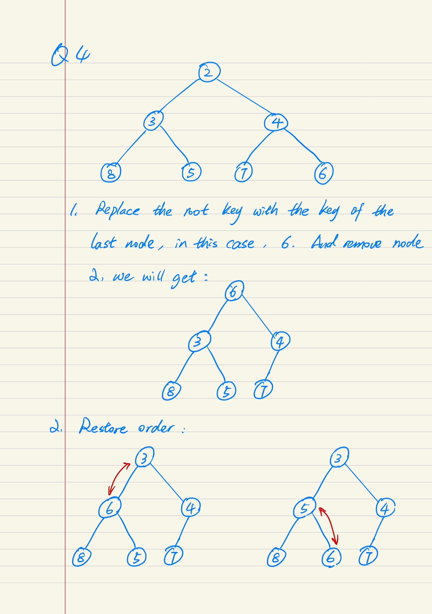
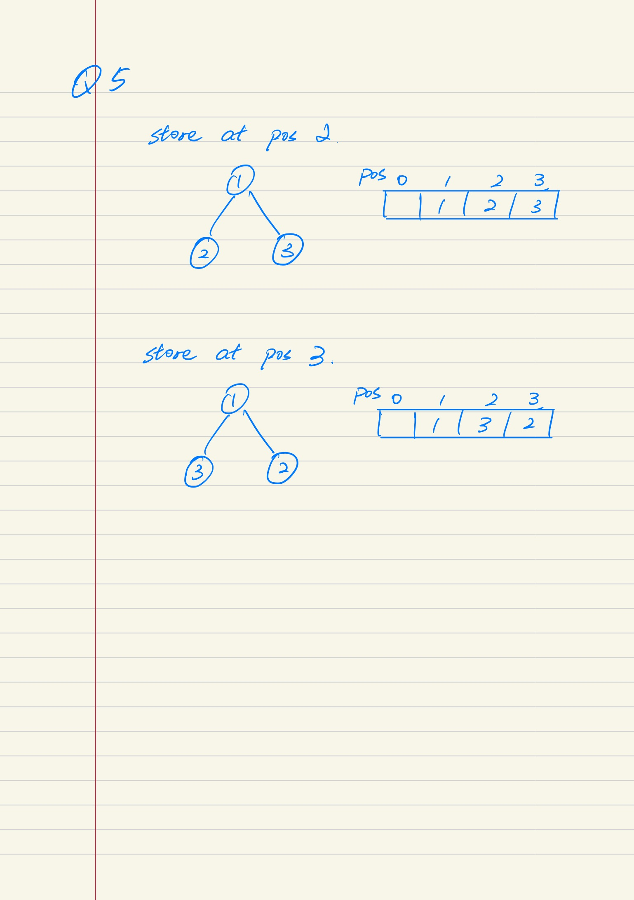
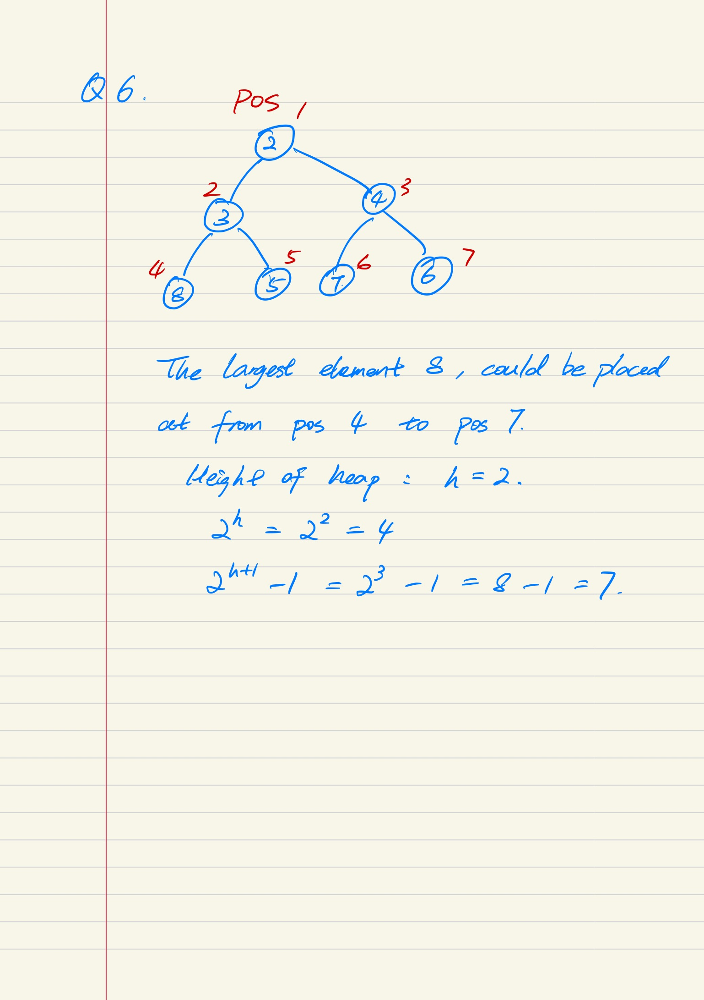

# CP2410 Practical 07
## Sihan Chen, jcu ID: 14187662

## Question 1
Sort list [5, 6, 3, 1, 2, 7, 9, 8]

a). Insertion Sort
elements are first added at the end of the list, and it will be keep comparing to the leftside element until the leftside is no longer smaller than its value.
``` python
[5]
[5, 6]
[3, 5, 6]                   # insert 3
[1, 3, 5, 6]                # insert 1
[1, 2, 3, 5, 6]             # insert 2
[1, 2, 3, 5, 6, 7]   
[1, 2, 3, 5, 6, 7, 9]
[1, 2, 3, 5, 6, 7, 8, 9]    # insert 8
```

b). Selection Sort
iterate through the entire list, at index i, find (i+1)th smallest element in the list and move it to position i. (e.g., at index 0, put 1st smallest element there)
``` python
[1, 6, 3, 5, 2, 7, 9, 8]    # interchange 5 and 1
[1, 2, 3, 5, 6, 7, 9, 8]    # interchange 6 and 2
[1, 2, 3, 5, 6, 7, 9, 8]    # list is already sorted at this point
```

## Question 2
Here is an example of worst case using insertion-sort, which would has time complexity of O(n^2).

To sort any list in the completely reverse order, such as [5, 4, 3, 2, 1], the algorithm of insertion sort needs to compare every value for the length of current list.
``` python
[5]
[4, 5]              # insert 4
[3, 4, 5]           # insert 3
[2, 3, 4, 5]        # insert 2
[1, 2, 3, 4, 5]     # insert 1
```
> Time cost: O[1 + 2 + ... + (n-1) + n] = O(n^2)

<div style="page-break-after: always;"></div>

## Question 3
Adding 5, 1, 4, 7, 3, 9, 0, 2, 8 to an initially empty heap, the state of heap at each point is:



<div style="page-break-after: always;"></div>

## Question 4
Here are the steps required to remove key 2 from the heap:



<div style="page-break-after: always;"></div>

## Question 5
The third smallest key could be store at either position 2 or position 3.

Ex.



<div style="page-break-after: always;"></div>

## Question 6
For a heap with height o f `h`, the position of largest key could be from `2^h` to `2^(h+1) - 1`.

Ex.

