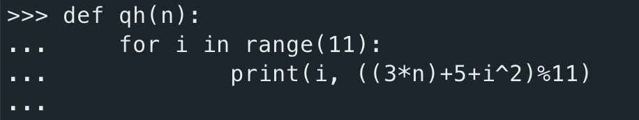

# CP2410 Practical 08
## Sihan Chen, jcu ID: 14187662

## Question 1
Hash function: $h(i) = (3i+5) \mod 11$

| Key | Hash Value |
| --- | ---        |
| 12 | 8 |
| 44 | 5 |
| 13 | 0 |
| 88 | 5 |
| 23 | 8 |
| 94 | 1 |
| 11 | 5 |
| 39 | 1 |
| 20 | 10|
| 16 | 9 |
| 5  | 9 |

and handling collisions with chaining will give us a hash table below: 


<div style="page-break-after: always;"></div>

## Question 2
If the collisions are handled by linear probing, we will have a hash table look like this:


## Question 3
If the collisions are handled by quadratic probing

$A[h(i) + j^2]\ (mod\ N), for\ j = 0, 1, \cdots, N - 1$

we can build a simple python function helps us to check quadratic probing new values



and insert elements up to the point of failure, we will have a hash table look like this (next page):

<div style="page-break-after: always;"></div>


<div style="page-break-after: always;"></div>

## Question 4
If the collisions are handled by double hashing

$H(i) = (h(i) + j*h'(i))\ mod\ N, for\ j = 0, 1, \cdots, N - 1$

we can build a simple python function helps us to check quadratic probing new values


the final hash table would look like this:


<div style="page-break-after: always;"></div>

## Question 5
With new hash function $h(k) = 3k \mod 17$

| Key | Hash Value |
| --- | ---        |
| 54 | 9 |
| 18 | 3 |
| 10 | 13 |
| 25 | 7 |
| 28 | 16 |
| 36 | 6 |
| 38 | 12 |
| 41 | 4 |
| 12 | 2 |
| 90 | 15 |

So, the new hash table would look like this:


<div style="page-break-after: always;"></div>

## Question 6
We can use the `binary search` technique to reduce search time on each row from $O(n)$ to $O(lg(n))$. For each row of the matrix, we will split the row in middle, and keep doing the splitting while there are 0s in the left or 1s in the right (by checking last element in left and first element in right).
If the left's last element is 0, we call function recursively on left half, otherwise on the right half.
And the base case is length of input list is 1.

```python
def count_ones(A:list[list[int]]) -> int:
    """ Return number of 1s in the matrix(n x n). """
    result = 0
    for row in A:
        result += count_ones_in_row(row)
    return result

def count_ones_in_row(row:list[int]) -> int:
    """ Return number of one in a row. """
    result = 0
    n = len(row)

    if n == 1:
        return 1 if row[0] == 1 else 0

    left = row[:n//2]
    right = row[n//2:]
    if left[-1] == 0 or right[0] == 1:
        if left[-1] == 0:
            return count_ones_in_row(left)
        else: # 1 in right 
            return len(left) + count_ones_in_row(right)
    else:
        return len(left)
```

This way, we can achieve time complexity of $O(n*lg(n))$.And here we can see the result appears to be correct on test input:


<script type="text/javascript" src="http://cdn.mathjax.org/mathjax/latest/MathJax.js?config=TeX-AMS-MML_HTMLorMML"></script>
<script type="text/x-mathjax-config">
    MathJax.Hub.Config({ tex2jax: {inlineMath: [['$', '$']]}, messageStyle: "none" });
</script>
