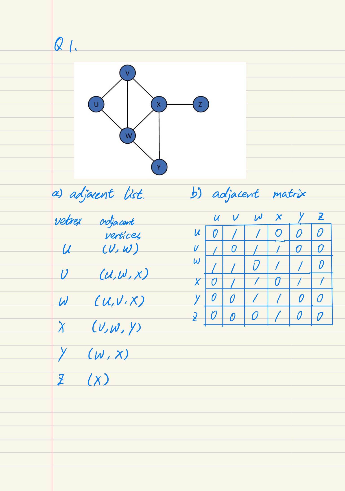
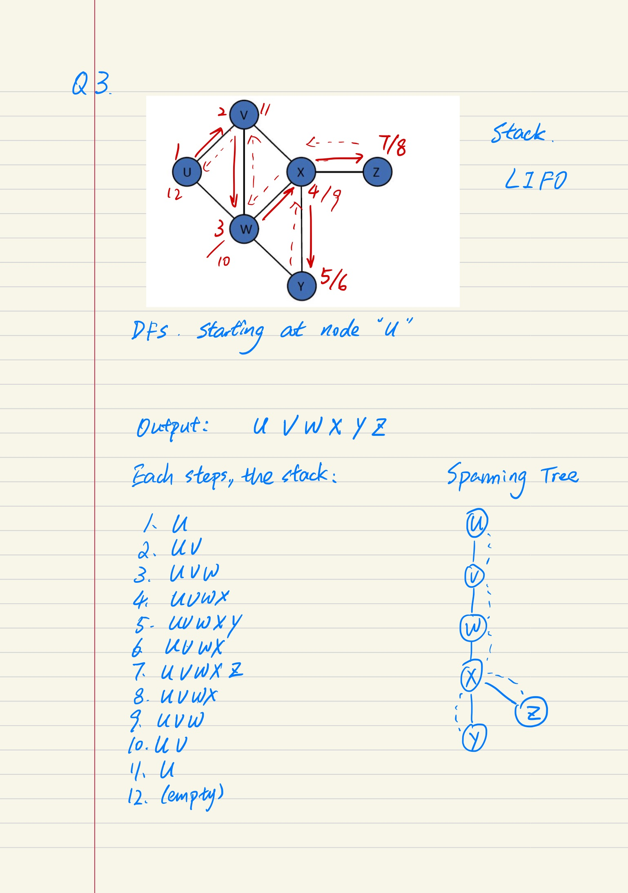

# CP2410 Practical 11
## Sihan Chen, jcu ID: 14187662

## Question 1

## Question 2

The breadth-first search method goes over all edge nodes in alphabetical order, outputs unvisited nodes, keeps a record of visited nodes, and stores edge nodes in a queue. Once all edge nodes of the current node are visited, we will dequeue a new node from queue as current node, untill no more nodes left in the queue. 

## Question 3

Depth-first search method will keep going to next unvisited edge node in alphabetical-order, keep track of visited nodes, store visit path in a stack, until all edge nodes of current node are visited. Then, backtrack to the previous node by pop from the stack, untill no more nodes left in the stack. 

## Question 4

