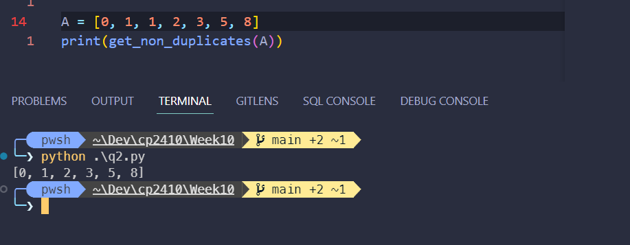
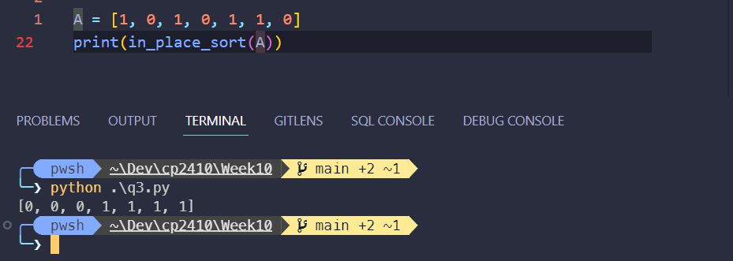
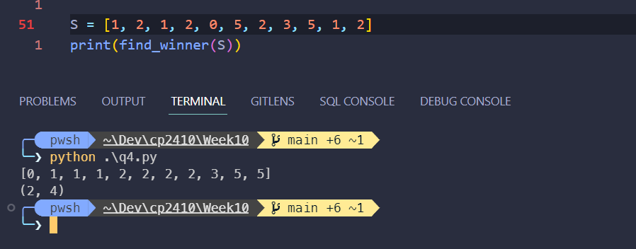
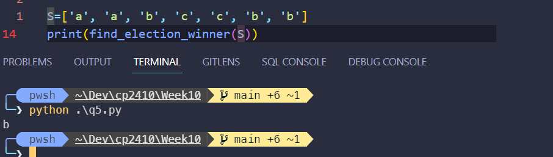
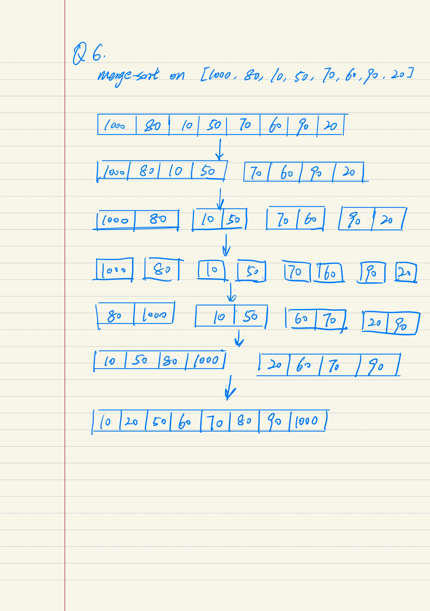

# CP2410 Practical 10
## Sihan Chen, jcu ID: 14187662

## Question 1
The `merge-sort` will always take $O(n\times lg(n))$ time. 

The `quick-sort` will expected (on average) to have time complexity of $\Theta (n\times lg(n))$, while the worst case time complexity is $O(n^2)$.


## Question 2
Here is an implementation with time complexity of $O(n)$:

```python
def get_non_duplicates(A: list) -> list:
    """ Return all non-duplicated elements. """
    result = []
    # In case of empty list
    if not A:
        return result
    # Insert the first element, start iteration from index of 1
    result.append(A[0])
    for i in range(1, len(A)):
        if A[i] != A[i - 1]:
            result.append(A[i])
    return result
```

Here is a screenshot from testing the code:



<div style="page-break-after: always;"></div>

## Question 3
Here is an in-place method of sorting all 0s before 1s.
``` python
def in_place_sort(A: list[int]) -> list:
    """ Sort all 0s before 1s in place. """
    i, j = 0, len(A) - 1
    # from left to right, find first 1 at index i
    for i in range(len(A)):
        if A[i] == 1:
            break
    # from right to left, find first 0 at index j
    for j in range(len(A)-1, -1, -1):
        if A[j] == 0:
            break
    # if i is bigger, the list is sorted
    if i > j:
        return A
    else:
        # otherwise 1 appears before 0, swap i and j
        A[i] = 0
        A[j] = 1
        return in_place_sort(A)
```

Here is a screenshot from testing the code:



<div style="page-break-after: always;"></div>

## Question 4
To achieve time complexity of $O(n\times log(n))$, we can do a merge-sort on the sequence S. Then loop through the sorted array to find the most common element.
```python
def find_winner(S:list[int]) -> int:
    """ Return the most frequent int, which represents a candidate. """
    # two edge cases
    if not S:
        return -1
    if len(S) == 1:
        return S[0]

    merge_sort(S)
    winner = S[0]
    prev_start = 0
    most_frequent = 0
    for i in range(1, len(S)):
        if S[i] != S[i-1]:
            count = i - prev_start
            if count > most_frequent:
                most_frequent = count
                winner = S[i-1]
            prev_start = i
    return winner


def merge_sort(arr):
    if len(arr) > 1:
        mid = len(arr) // 2
        L = arr[:mid]
        R = arr[mid:]
        merge_sort(L)
        merge_sort(R)
        i = j = k = 0
        while i < len(L) and j < len(R):
            if L[i] <= R[j]:
                arr[k] = L[i]
                i += 1
            else:
                arr[k] = R[j] 
                j += 1
            k += 1
        while i < len(L):
            arr[k] = L[i]
            i += 1
            k += 1
        while j < len(R):
            arr[k] = R[j]
            j += 1
            k += 1
```

Here is a screenshot from testing the code:




## Question 5
To achieve time complexity of $O(n)$, we can use dictionary (hash table) to track votes:

```python
def find_election_winner(S: list[str]) -> str:
    """ Find the ecandidate with most votes. """
    d = {}
    for i in S:
        if i in d:
            d[i] = d[i] + 1
        else:
            d[i] = 0
    
    # return the key with highest value
    return max(d, key=d.get)
```

Here is a screenshot from testing the code:



<div style="page-break-after: always;"></div>

## Question 6



<script type="text/javascript" src="http://cdn.mathjax.org/mathjax/latest/MathJax.js?config=TeX-AMS-MML_HTMLorMML"></script>
<script type="text/x-mathjax-config">
    MathJax.Hub.Config({ tex2jax: {inlineMath: [['$', '$']]}, messageStyle: "none" });
</script>
